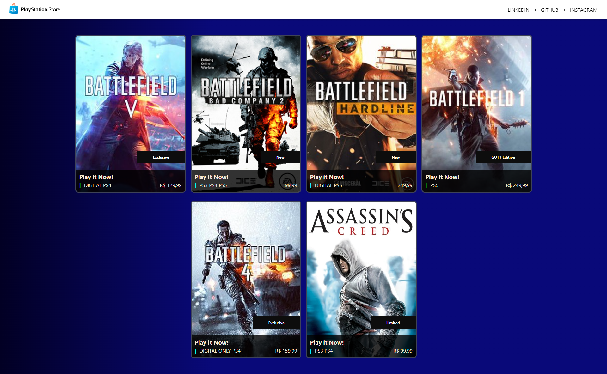

# ❤ PS-Store

Página da PlayStation Store responsiva construída com Angular usando injeção de dependências e dados dinâmicos.

[Clique aqui para acessar](https://ps-store-one.vercel.app/)

## 🛠 Tecnologias

- TypeScript
- Angular
- HTML
- CSS
